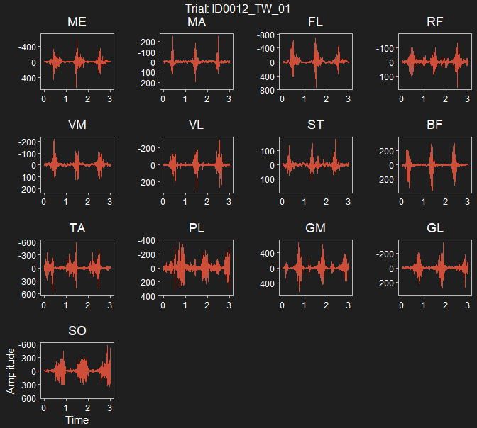
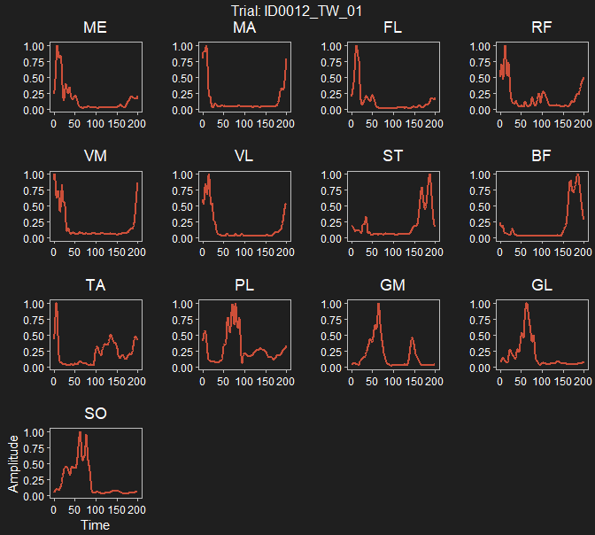

# musclesyneRgies

The package `musclesyneRgies` allows to extract muscle synergies from electromyographic (EMG) data through linear decomposition based on unsupervised machine learning. Specifically, here we adopted the non-negative matrix factorization (NMF) framework, due to the non-negative nature of EMG biosignals. However, this method can be applied to any other kind of data sets, from time series to images.

## Installation
- [Download R](https://cran.r-project.org/mirrors.html) and install (please have R >= 3.5.0)
- [Download RStudio](https://rstudio.com/products/rstudio/download/) and install
- Depending on your OS, you will need to install [Rtools](https://cran.r-project.org/bin/windows/Rtools/) (Windows), [Xcode](https://developer.apple.com/xcode/) (macOS) or a specific compiler for Linux (e.g., for Ubuntu-based you can install the `r-base-dev` package).
- Open RStudio and install the package `devtools` with `install.packages("devtools")`
- Load `devtools` with `library(devtools)`
- Install the package `musclesyneRgies` with `install_github("alesantuz/musclesyneRgies")`.

Done! Now the package is installed on your computer.

## What this package does:
- Filter and normalise raw EMG
- Extract muscle synergies
- Classify the extracted muscle synergies
- Analyse muscle synergies with linear and nonlinear metrics
- Plot any data set involved in the process
- All the above tweakable, but with sensible defaults.

## What this package does not do:
- Run the statistics for you
- All that is not specified in the list above.

## Workflow example
All the code in this section will work as in the example if you copy and paste it in R or RStudio.

```r
# Load the package
library(musclesyneRgies)

# Load the built-in example data set
data("RAW_DATA")

# Say you recorded more cycles than those you want to consider for the analysis
# You can subset the raw data (here to the first 3 cycles, starting from the first)
RAW_DATA_subset <- pbapply::pblapply(RAW_DATA,
                                     function(x) subsetEMG(x,
                                                           cy_max=3,
                                                           cy_start=1))

# Raw EMG can be plotted with the following (the first three seconds are plot by default)
plot_rawEMG(RAW_DATA[[1]],
            trial=names(RAW_DATA)[1])
```

<!-- -->

```r
# The raw EMG data set then needs to be filtered
# If you don't want to subset the data set, just filter it as it is
# Here we filter the whole data set with the default parameters for locomotion:
# - Demean EMG
# - High-pass IIR Butterworth 4th order filter (cut-off frequency 50 Hz)
# - Full-wave rectification (default)
# - Low-pass IIR Butterworth 4th order filter (cut-off frequency 20 Hz)
# - Minimum subtraction
# - Amplitude normalisation
filtered_EMG <- pbapply::pblapply(RAW_DATA, function(x) filtEMG(x))

# If you decide to change filtering parameters, just give them as arguments:
another_filtered_EMG <- pbapply::pblapply(RAW_DATA,
                                          function(x) filtEMG(x,
                                                              demean=FALSE,
                                                              rectif="halfwave",
                                                              HPf=30,
                                                              HPo=2,
                                                              LPf=10,
                                                              LPo=2,
                                                              min_sub=FALSE,
                                                              ampl_norm=FALSE))

# Now the filtered EMG needs some time normalisation so that cycles will be comparable
# Here we time-normalise the filtered EMG, including only three cycles and trimming first and last to remove unwanted filtering effects
# Each cycle is divided into two parts, each normalised to a length of 100 points
norm_EMG <- pbapply::pblapply(filtered_EMG,
                              function(x) normEMG(x,
                                                  trim=TRUE,
                                                  cy_max=3,
                                                  cycle_div=c(100, 100)))

# If this cycle division does not work for you, it can be changed
# But please remember to have the same amount of columns in the cycle times as the number of phases you want your cycles to be divided into
# Here we divide each cycle with a ratio of 60%-40% and keep only two cycles (first and last are still trimmed, so to have two cycles you must start with at least four available)
another_norm_EMG <- pbapply::pblapply(filtered_EMG,
                                      function(x) normEMG(x,
                                                          trim=TRUE,
                                                          cy_max=2,
                                                          cycle_div=c(120, 80)))

# The filtered and time-normalised EMG can be plotted with the following
plot_meanEMG(norm_EMG[[1]],
             trial=names(norm_EMG)[1])
```

<!-- -->

```r
# At this stage, synergies can be extracted
# This is the core function to extract synergies via NMF
SYNS <- pbapply::pblapply(norm_EMG, synsNMF)

# The extracted synergies can be plotted with the following
plot_syn_trials(SYNS[[1]],
                max_syns=max(unlist(lapply(SYNS, function(x) x$syns))),
                trial=names(SYNS)[1])
```

<!-- -->

```r
# Now synergies don't have a functional order and need classification
# Let's load the built-in data set to have some more trial to classify
# (clustering cannot be done on only one trial and having just a few, say less than 10, won't help)
data("SYNS")

# Classify with k-means# and producing a plot that shows how the clustering went with:
# - Full width at half maximum on the x-axis
# - Centre of activity on the y-axis
# (both referred to the motor primitives of the classified muscle synergies)
SYNS_classified <- classify_kmeans(SYNS,
                                   path_for_graphs=NA,
                                   interactive=FALSE)
```

<!-- -->

```r
# Classified synergies can be finally plotted with
plot_classified_syns(SYNS_classified,
                     condition="TW") # "TW" = Treadmill Walking, change with your own if needed
```

<!-- -->

```r
# A 2D UMAP plot of the classified synergies can be obtained with
plot_classified_syns_UMAP(SYNS_classified,
                          condition="TW")
```

<!-- -->

```r
# From now on, it's all about the analysis
# For example, one can measure the full width at half maximum (FWHM) of the motor primitives
# or their centre of activity (CoA)
# Load a typical motor primitive of 30 cycles (from locomotion)
data("primitive")

# Reduce primitive to the first cycle
prim_sub <- primitive$signal[1:which(primitive$time==max(primitive$time))[1]]

# Calculate FWHM of the first cycle
prim_sub_FWHM <- FWHM(prim_sub)
# Calculate CoA of the first cycle
prim_sub_CoA  <- CoA(prim_sub)

# Half maximum (for the plots)
hm <- min(prim_sub)+(max(prim_sub)-min(prim_sub))/2
hm_plot <- prim_sub
hm_plot[which(hm_plot>hm)] <- hm
hm_plot[which(hm_plot<hm)] <- NA

# Plots
plot(prim_sub, ty="l", xlab="Time", ylab="Amplitude")
lines(hm_plot, lwd=3, col=2) # FWHM (horizontal, in red)
graphics::abline(v=prim_sub_CoA, lwd=3, col=4) # Coa (vertical, in blue)
```

<!-- -->

```r
# Or perhaps one might want to investigate the nonlinear behaviour of a long primitive
prim <- primitive$signal

# Calculate the local complexity or Higuchi's fractal dimension (HFD)
nonlin_HFD <- HFD(prim)$Higuchi
# Calculate the local complexity or Hurst exponent (H)
nonlin_H   <- Hurst(prim, min_win = max(primitive$time))$Hurst

message("Higuchi's fractal dimension: ", round(nonlin_HFD, 3))
```

```
## Higuchi's fractal dimension: 1.047
```

```r
message("Hurst exponent: ", round(nonlin_H, 3))
```

```
## Hurst exponent: 0.338
```

## Pro tips

```r
# Note that for bigger data sets one might want to run synergy extraction in parallel
# This can be done with the following code, requiring the package "parallel"

# Load the built-in example data set
data("FILT_EMG")

# Create cluster for parallel computing if not already done
clusters <- objects()

if (sum(grepl("^cl$", clusters))==0) {
  # Decide how many processor threads have to be excluded from the cluster
  # It is a good idea to leave at least one free, so that the machine can be used during computation
  cl <- parallel::makeCluster(max(1, parallel::detectCores()-1))
}
# Extract synergies in parallel (will speed up computation only for larger data sets)
SYNS <- pbapply::pblapply(FILT_EMG, musclesyneRgies::synsNMF, cl=cl)

parallel::stopCluster(cl)
```
